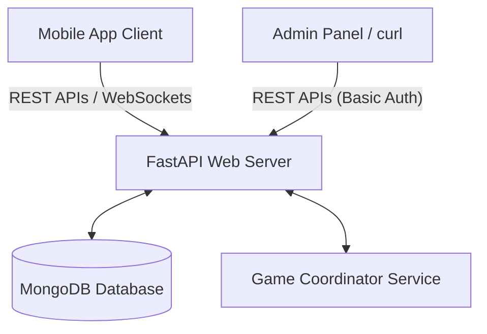

# Local Trivia Platform

A real-time, community-level synchronized multiplayer trivia platform. This project features a high-performance asynchronous Python & FastAPI backend, MongoDB for persistence, and a modern, high-fidelity Flutter mobile application client.

---

## Architecture Overview

The system is designed with a centralized state coordinator managing real-time websocket synchronization across multiple players.



- **Backend**: Containerized FastAPI web app exposing a RESTful API and WebSocket endpoints.
- **MongoDB**: Used for storing persistent master schemas (questionnaires, contests, user accounts, and final standing records).
- **Game Coordinator**: An in-memory room controller managing countdown timers, active live sessions, answer speed formulas, and connection fallback syncs.
- **Frontend**: Flutter app featuring custom HTTP & WebSocket managers, an integrated QR Scanner, local clipboard listeners, and responsive play screens.

---

## MongoDB Collections

The application database is named `local_trivia` (or `local_trivia_test` during testing) and contains four main collections:

### 1. `users`
Stores participant user profiles mapping unique usernames to device tokens.
* **Fields**:
  - `_id`: `ObjectId` (Primary Key)
  - `deviceToken`: `string` (Unique token generated on app install)
  - `username`: `string` (Unique user display name)
  - `avatarUrl`: `string` (Dicebear auto-generated bot avatar URL)
  - `addedContests`: `Array<ObjectId>` (List of contests added to the user's dashboard)
  - `createdAt`: `ISODate`
* **Indexes**:
  - `deviceToken` (Unique)
  - `username` (Unique)

### 2. `questionnaires`
Stores the master list of trivia questionnaires containing pools of questions.
* **Fields**:
  - `_id`: `ObjectId` (Primary Key)
  - `title`: `string` (Unique title of the questionnaire)
  - `interQuestionBufferSeconds`: `integer` (Pause delay between consecutive questions, default: `5`)
  - `questions`: `Array<Question>`
    - `_id`: `ObjectId`
    - `questionText`: `string`
    - `options`: `Array<string>` (Exactly 4 items; the **first** option index `0` is always the correct answer)
    - `timeLimitSeconds`: `integer` (Duration players have to answer)
    - `initialScore`: `integer` (Max score multiplier before speed-decay penalty)
  - `createdAt`: `ISODate`
* **Indexes**:
  - `title` (Unique)

### 3. `contests`
Stores active or scheduled contest event instances.
* **Fields**:
  - `_id`: `ObjectId` (Primary Key)
  - `questionnaireTitle`: `string` (References `questionnaires.title`)
  - `scheduledStartTime`: `integer` (Epoch timestamp in UTC seconds)
  - `status`: `string` (`SCHEDULED`, `ACTIVE`, `COMPLETED`)
  - `contenders`: `Array<ObjectId>` (List of registered user IDs)
  - `entryFee`: `integer` (Fee in credits/tokens required to join)
  - `prizePool`: `double` (Entry Fee * number of enlists)
  - `qr`: `string` (The onboarding join URL containing the contest ID)
  - `qrCodeBase64`: `string` (Base64-encoded PNG image data of the QR code)
  - `currentQuestionIndex`: `integer` (The active live question index, defaults to `-1` before start)
  - `questionShuffles`: `Array<Shuffle>` (Pre-generated randomized option configurations for consistency)
    - `questionId`: `ObjectId`
    - `shuffledOptions`: `Array<string>`
  - `finalLeaderboard`: `Array<LeaderboardEntry>` or `null`
    - `username`: `string`
    - `score`: `double`
    - `rank`: `integer`
  - `createdAt`: `ISODate`
* **Indexes**:
  - `status`
  - `qr` (Unique)

### 4. `submissions`
Logs answer submissions for scoring audits.
* **Fields**:
  - `_id`: `ObjectId` (Primary Key)
  - `contestId`: `ObjectId` (References `contests._id`)
  - `userId`: `ObjectId` (References `users._id`)
  - `questionId`: `ObjectId` (References a question within the questionnaire)
  - `selectedOptionIndex`: `integer` (Option index chosen by the player)
  - `isCorrect`: `boolean` (True if selection matched original index `0` option)
  - `timeTakenMs`: `integer` (Reaction time in milliseconds)
  - `score`: `double` (Points awarded, taking speed multiplier decay into account)
  - `submittedAt`: `ISODate`
* **Indexes**:
  - `contestId`, `userId` (Compound index)
  - `contestId`, `questionId` (Compound index)

---

## API Reference

### 1. Participant Routes

#### `POST /register`
Creates or logs in a user profile.
- **Request Body**:
  ```json
  {
    "deviceToken": "unique-device-identifier-uuid",
    "username": "TriviaChampion"
  }
  ```
- **Response** (201 Created):
  ```json
  {
    "id": "6475f4d...",
    "username": "TriviaChampion"
  }
  ```

#### `POST /contests/add`
Discovers a contest and adds it to the user's dashboard.
- **Headers**: `Authorization: Bearer <deviceToken>`
- **Request Body**:
  ```json
  {
    "qr": "http://127.0.0.1:8080/join?contestId=6475f8..."
  }
  ```
- **Response** (200 OK):
  ```json
  {
    "message": "Contest added to dashboard successfully",
    "contestId": "6475f8..."
  }
  ```

#### `GET /contests`
Lists all contests added to the user's dashboard.
- **Headers**: `Authorization: Bearer <deviceToken>`
- **Response** (200 OK):
  ```json
  [
    {
      "id": "6475f8...",
      "questionnaireTitle": "Science Vol. 1",
      "scheduledStartTime": 1782393849,
      "entryFee": 5,
      "prizePool": 25.0,
      "qr": "http://127.0.0.1:8080/join?contestId=6475f8...",
      "qrCodeBase64": "data:image/png;base64,...",
      "status": "ENLISTED",
      "originalStatus": "SCHEDULED"
    }
  ]
  ```
  *Note: The returned `status` parameter computes a user-specific value: `ADDED`, `ENLISTED`, `LIVE`, `COMPLETED`, or `MISSED`.*

#### `GET /contests/{id}`
Returns details for a specific contest.
- **Headers**: `Authorization: Bearer <deviceToken>`

#### `POST /contests/{id}/enlist`
Registers the player as an active contender for the contest, updating the contest prize pool.
- **Headers**: `Authorization: Bearer <deviceToken>`
- **Response** (200 OK):
  ```json
  {
    "message": "Successfully enlisted",
    "prizePool": 30.0
  }
  ```

#### `GET /join`
Serves a smart redirect webpage. Used to register links scanned via generic mobile camera app.
- **Query Parameters**: `contestId`
- **Behavior**:
  - Copies `"TRIVIA:<contestId>"` to the clipboard.
  - Detects iOS or Android OS and redirects to the respective store link.

---

### 2. Live WebSocket Game Protocol
Real-time gameplay runs over WebSockets on `ws://<base_url>/ws`.

- **Endpoint**: `/ws?token=<deviceToken>&contestId=<contestId>`
- **Events Sent by Client**:
  - `SUBMIT_ANSWER`:
    ```json
    {
      "event": "SUBMIT_ANSWER",
      "data": {
        "questionId": "6475fa...",
        "selectedOptionIndex": 2,
        "timeTakenMs": 1450
      }
    }
    ```
- **Events Sent by Server**:
  - `LOBBY_STATE`: Broadcasts time remaining before the contest starts.
  - `QUESTION_START`: Broadcasts new question text and options:
    ```json
    {
      "event": "QUESTION_START",
      "data": {
        "questionId": "6475fa...",
        "questionText": "What is the capital of France?",
        "options": ["London", "Paris", "Berlin", "Rome"],
        "timeLimitSeconds": 15,
        "questionIndex": 0,
        "totalQuestions": 10,
        "endTime": 1782394000.45
      }
    }
    ```
  - `QUESTION_END`: Reveals the correct answer (always maps to index `0` of the original questionnaire question) and broadcasts the user's score details.
  - `INTER_QUESTION_LEADERBOARD`: Displays intermediate top standings.
  - `CONTEST_COMPLETED`: Stream ends and serves the final standings leaderboard.

---

### 3. Admin Routes (Protected by Basic Auth)
All endpoints require a `WWW-Authenticate` Basic Auth header containing configured credentials.

#### `POST /admin/questionnaires`
Creates a master questionnaire.
- **Request Body**:
  ```json
  {
    "title": "History Vol. 1",
    "interQuestionBufferSeconds": 5,
    "questions": [
      {
        "questionText": "Who built the Pyramids?",
        "options": ["Egyptians", "Romans", "Greeks", "Maya"],
        "timeLimitSeconds": 10,
        "initialScore": 1000
      }
    ]
  }
  ```

#### `GET /admin/questionnaires` / `GET /admin/questionnaires/{id}` / `PUT` / `DELETE`
Standard CRUD APIs for managing questionnaires.

#### `POST /admin/contests`
Creates a scheduled contest instance.
- **Request Body**:
  ```json
  {
    "questionnaire_title": "History Vol. 1",
    "scheduledStartTime": 1782396000,
    "entryFee": 10,
    "qr": null
  }
  ```
  *Note: If `qr` is omitted (`null`), the backend pre-generates a contest `ObjectId` and builds the QR URL using the environment's `BASE_URL` (e.g. `http://127.0.0.1:8080/join?contestId=<id>` for dev setups).*
- **Response** (201 Created):
  ```json
  {
    "id": "6475fcf..."
  }
  ```

#### `GET /admin/contests/{id}/qr`
Returns the contest's QR code image.
- **Headers**: `Authorization: Basic <credentials>`
- **Response** (200 OK):
  - **Content-Type**: `image/jpeg`
  - **Body**: The binary stream of the generated QR code in JPEG format.

---

## Development Setup

### Prerequisite Configuration
Ensure you have Docker and Flutter installed.

### 1. Run the Backend & Database Stack
Execute the following command in the root project folder:
```bash
docker compose up -d
```
- The backend API will expose port `8080` (mapped to internal container port `8000`).
- Interactive OpenAPI documentation will be available at `http://localhost:8080/docs`.

### 2. Run the Flutter Application
Connect a physical Android/iOS phone or start an emulator. Then execute the environment startup script:

**Windows**:
```cmd
.\scripts\startAndroidApp.bat
```

**macOS/Linux**:
```bash
./scripts/startAndroidApp.sh
```

These scripts automate ADB reverse port forwarding (`adb reverse tcp:8080 tcp:8080`), allowing physical devices connected via USB to access the backend running on your computer's localhost interface safely.
