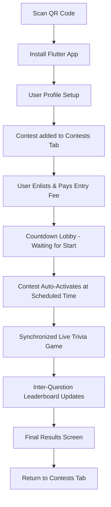
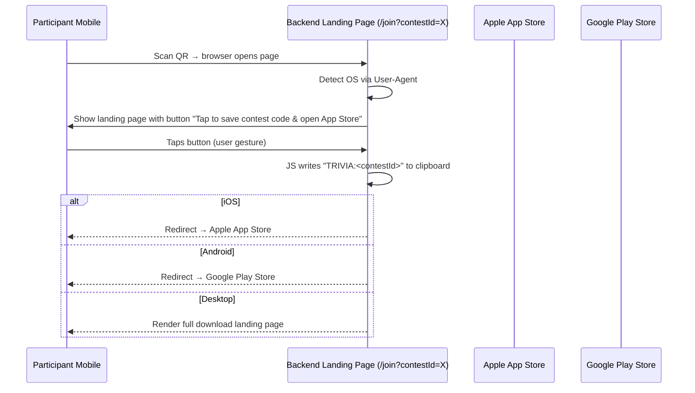
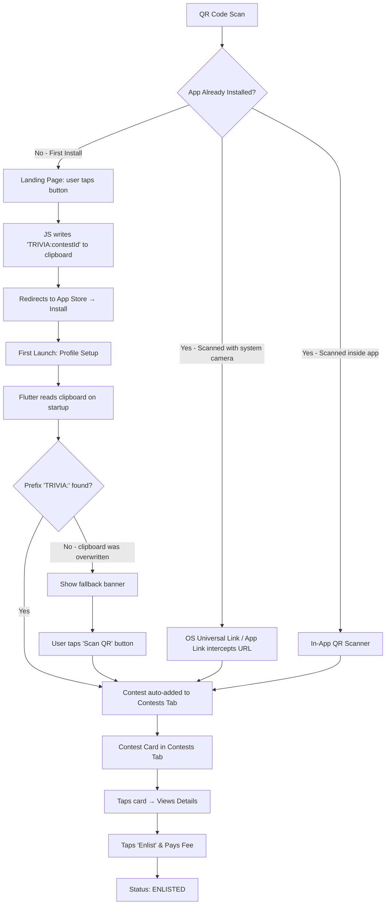
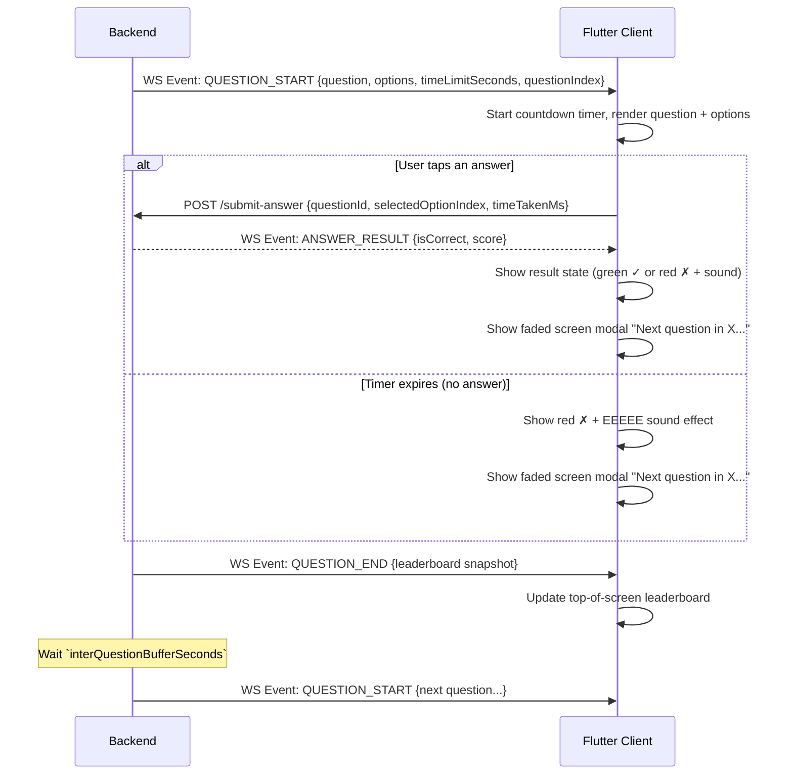

# Project Specification: Local Trivia App

A real-time, community-level trivia contest platform designed for synchronized multiplayer competitive play.

---

## 1. Executive Summary & Flow

Local Trivia is a mobile application built with Flutter and powered by a Python & MongoDB backend. It allows community organizers to run scheduled, real-time trivia events where participants compete simultaneously.

### Core User Journey



1. **Onboarding**: Users scan a unified QR code. The Python backend detects their device OS and redirects to the appropriate App Store (iOS or Android), or serves a landing page on desktop.
2. **Contest Discovery**: After registration, the contest linked to the QR code is automatically added to the user's **Contests Tab** via deferred deep linking.
3. **Enlistment**: The user taps the contest card, reviews details, and pays the entry fee to become an official contender.
4. **Lobby**: Users who enter the contest before start time see a countdown screen. A WebSocket connection is established upon entering the lobby.
5. **Live Play**: At the scheduled epoch timestamp, the backend auto-activates the contest and begins pushing questions to all connected clients simultaneously.
6. **Scoring & Leaderboard**: After each question, standings are updated and broadcast to all clients.
7. **Conclusion**: A final results screen shows the partial leaderboard with prizes for top 3, and the user's own placement, until they actively dismiss it.

---

### 1.1. Smart QR Onboarding & Redirection Flow

The QR code encodes `https://trivia.local/join?contestId=<CONTEST_ID>`. The backend `/join` page serves different behaviour based on OS detection:



- **Scan Destination**: `https://trivia.local/join?contestId=<CONTEST_ID>`
- The landing page **always renders a visible button** (required for the clipboard write user-gesture on iOS and modern Chrome). It doubles as a pleasant branded entry point.
- The JS clipboard payload format: `"TRIVIA:<contestId>"` (prefixed to avoid false matches on unrelated clipboard contents).

---

### 1.2. Contest Discovery & Enlistment Flow

A contest must first be **added** to the user's Contests Tab, then **enlisted** (paid) before they can participate.

Three distinct paths cover all user states:



#### Path 1 — New User (First Install): Clipboard Injection
1. User scans QR → backend landing page opens in browser.
2. User taps the visible CTA button. JS writes `"TRIVIA:<contestId>"` to clipboard and redirects to the App Store.
3. User installs and opens the app for the first time.
4. After profile setup, Flutter reads the clipboard:
   ```dart
   final data = await Clipboard.getData(Clipboard.kTextPlain);
   if (data?.text?.startsWith('TRIVIA:') == true) {
     final contestId = data!.text!.substring(7);
     // add contest, then clear clipboard
     await Clipboard.setData(const ClipboardData(text: ''));
   }
   ```
5. Contest is silently added to the Contests Tab. A toast confirms: *"Contest added from your QR scan!"*
6. **Fallback**: If the clipboard was overwritten (user copied something else between scan and launch), the contest is not auto-added. A persistent banner displays: *"Scanned a contest QR? Use the Scan button below to add it."*

> **iOS note**: Flutter reading the clipboard triggers an OS notification banner *"Local Trivia pasted from [App]"*. This is expected and non-blocking. Because the landing page explicitly tells the user their code was copied, this banner feels intentional rather than alarming.

#### Path 2 — Existing User, System Camera: Universal Links / App Links
- When the app is published, the backend hosts:
  - `/.well-known/apple-app-site-association` (iOS Universal Links)
  - `/.well-known/assetlinks.json` (Android App Links)
- The OS intercepts the QR URL and opens the app directly with the full `contestId` query param — no browser, no clipboard, no extra tap.
- This is the primary production path for users who already have the app installed.

#### Path 3 — Existing User, In-App Scanner
- User taps **"Scan QR Code"** in the Contests Tab.
- The in-app camera scanner reads the QR URL, extracts `contestId`, and adds the contest immediately.

#### How Users Enlist
- Adding a contest places it in the Contests Tab as `ADDED` status.
- The user taps the card, reviews scheduling info and entry fee, then taps **"Enlist"** and pays.
- On success, the user is added to the contest's `contenders` list and the card updates to `ENLISTED`.

---

### 1.3. Contest Card States (Contests Tab)

Each contest card in the Contests Tab reflects the user's relationship to the contest:

| State | Description |
|---|---|
| `ADDED` | Discovered but not yet enlisted/paid |
| `ENLISTED` | Paid and registered; contest not yet started |
| `LIVE` | Contest currently active — tap to enter the game room |
| `COMPLETED` | Contest finished — tap to view final results |
| `MISSED` | Contest ran while user was not connected |

> **Offline Completion Detection**: If a contest transitions to `COMPLETED` while a participant has no active WebSocket connection (e.g. they closed the app or lost connectivity), the client detects this status transition on its next periodic HTTP poll to `/contests` (or `/contests/{id}`). The client then transitions the user directly to the Final Results Screen.

---

### 1.4. Lobby & Waiting Room Flow

When a user taps a contest card in `ENLISTED` state before the start time:
1. They are taken to a **Countdown Lobby Screen** showing the time remaining until the contest starts.
2. A **WebSocket connection is established** at this point.
3. When the backend auto-activates the contest at the scheduled epoch timestamp, it broadcasts an `CONTEST_STARTED` event over the WebSocket. All connected clients transition to the first question screen simultaneously.
4. **Late Join & Reconnection**: If a user joins the lobby late (after the scheduled start time) or reconnects to the WebSocket during an active contest, they are immediately dropped into the current live question (see Section 1.5).

---

### 1.5. Live Question Lifecycle

Each question follows this exact lifecycle:



#### Reconnection & Late Joins (Immediate Question Catch-up)
- If a client disconnects and reconnects, or joins the contest room late while it is in the `ACTIVE` status:
  1. The client establishes a new WebSocket connection.
  2. The backend immediately detects the contest is in progress and pushes the current question's `QUESTION_START` event.
  3. The backend dynamically calculates the remaining time limit: `adjustedTimeLimit = originalTimeLimit - (now - questionStartTime)`.
  4. The client receives this adjusted duration in the payload and immediately renders the question with the countdown timer set to the remaining seconds.

#### Timeout Handling
- If a user does not answer within `timeLimitSeconds` (or within the remaining time on a late join/reconnect), the question is treated as **incorrect** and is **not recorded** in `submissions` (no submission document is created for that question).
- The client plays an error sound and shows the timeout state.

#### Inter-Question Buffer
- After each question's timer expires, the backend waits `interQuestionBufferSeconds` before pushing the next `QUESTION_START` event.
- Default buffer: **5 seconds** unless overridden by the `interQuestionBufferSeconds` field on the questionnaire.
- During this buffer, the faded "Next question in X" modal displays the live countdown on the client.

---

### 1.6. Final Results Screen

Shown to all clients after the last question ends:
- **Partial leaderboard** (top 3 with prizes displayed).
- **User's own placement** including the rank immediately above and below them (same relative display format as mid-game).
- **Total contender count** ("You placed Xth out of Y players").
- **Score** is shown alongside each displayed entry.
- Screen persists until the user **actively dismisses it** (taps a "Back to Contests" button).
- **Results Persistence**: When a contest finishes, the backend permanently calculates and persists the final leaderboard and user ranks in the database (inside the `Contest` document). This ensures that users who missed the live WebSocket finish (or return to a completed contest later) can load the exact same persistent results from the database.

---

## 2. Core Entities & Data Models

### 2.1. User Entity

Represents an anonymous profile bound to a physical device via a persistent secret token.

| Field | Type | Description |
|---|---|---|
| `_id` | ObjectId | Unique database identifier |
| `deviceToken` | String (UUID v4) | Client-generated secret; used as auth credential in all requests |
| `username` | String | **Unique** display name chosen by the user |
| `avatarUrl` | String (Optional) | Avatar image URL |
| `addedContests` | List\<ObjectId\> | Contest IDs added to the user's dashboard |
| `createdAt` | DateTime | Timestamp of registration |

#### Authentication & Account Recovery Model
- **Passwordless/Emailless Auth**: The Flutter app generates a UUID v4 `deviceToken` on first open and stores it in `flutter_secure_storage`. It is sent as a Bearer token in the `Authorization` header for all HTTP requests and WebSocket handshakes.
- **Profile Page**: The user can view their `deviceToken` ("Account Recovery Key") in the Profile tab, with a one-tap copy button.
- **Account Import**: An "Import Account Key" field allows pasting a previously saved `deviceToken` to restore a profile on a new device or after reinstall.

---

### 2.2. SingleQuestion Entity (Embedded in Questionnaire)

| Field | Type | Description |
|---|---|---|
| `_id` | ObjectId | Unique question ID |
| `questionText` | String | The question prompt |
| `options` | List\<String\> (exactly 4) | Possible answers. **The first item (index 0) is always the correct answer.** The backend shuffles options before delivering to clients |
| `timeLimitSeconds` | Integer | Time allowed to answer |
| `initialScore` | Integer | Base score for a correct answer (modified by speed bonus) |

---

### 2.3. Questionnaire Entity

| Field | Type | Description |
|---|---|---|
| `_id` | ObjectId | Unique ID |
| `title` | String (**unique**) | Name of the trivia set |
| `questions` | List\<SingleQuestion\> | Ordered embedded question documents |
| `interQuestionBufferSeconds` | Integer | Pause between questions (default: 5) |
| `createdAt` | DateTime | Creation timestamp |

---

### 2.4. Contest Entity

| Field | Type | Description |
|---|---|---|
| `_id` | ObjectId | Unique ID |
| `questionnaireTitle` | String | Reference to questionnaire by its unique title |
| `scheduledStartTime` | Integer (epoch seconds) | Unix timestamp of scheduled start |
| `status` | Enum | `SCHEDULED`, `ACTIVE`, `COMPLETED` |
| `contenders` | List\<ObjectId\> | User IDs who have enlisted and paid |
| `entryFee` | Integer | Entry fee in whole currency units |
| `prizePool` | Decimal | Dynamically calculated (`entryFee × contenders.length × rate`) |
| `qr` | String | The full URL manually inserted by the organizer (used for linking/sharing) |
| `qrCodeBase64` | String | Base64-encoded PNG image of the QR code generated by the backend |
| `currentQuestionIndex` | Integer | Index of the active question (-1 when not started) |
| `questionShuffles` | List\<Object\> | Persisted shuffled options for each question: `[ { questionId: ObjectId, shuffledOptions: List<String> } ]` |
| `finalLeaderboard` | List\<Object\> (Optional) | Persisted final rankings calculated and saved when the contest ends |
| `createdAt` | DateTime | Creation timestamp |

---

### 2.5. AnswerSubmission Entity

Created only when a user answers within the time limit (timeouts produce no document).

| Field | Type | Description |
|---|---|---|
| `_id` | ObjectId | Unique submission ID |
| `contestId` | ObjectId | Reference to the contest |
| `userId` | ObjectId | Reference to the user |
| `questionId` | ObjectId | Reference to the question |
| `selectedOptionIndex` | Integer (0-3) | Index in the **shuffled** options array sent to client |
| `isCorrect` | Boolean | True if selected index maps to correct answer |
| `timeTakenMs` | Integer | Milliseconds from question display to answer tap |
| `score` | Decimal | `initialScore × (1 - timeTakenMs / (timeLimitSeconds × 1000))` |
| `submittedAt` | DateTime | Server-side timestamp of submission |

---

### 2.6. Scoring Formula

```
questionScore = initialScore × (1 - timeTakenMs / (timeLimitSeconds × 1000))
```

- A **perfect answer** (answered instantly) scores the full `initialScore`.
- A **slow correct answer** scores progressively less.
- A **timeout or incorrect answer** scores **0** (no submission created for timeouts).
- Leaderboard ranking: **sum of all `score` values** per user, descending.

---

### 2.7. MongoDB Collection Schemas (BSON Mapping)

#### `users` Collection
```json
{
  "_id": { "$oid": "60d5ecb8b3d688001f30dc9e" },
  "deviceToken": "f81d4fae-7dec-11d0-a765-00a0c91e6bf6",
  "username": "SpeedyQuizzer",
  "avatarUrl": "https://api.dicebear.com/7.x/bottts/svg?seed=SpeedyQuizzer",
  "addedContests": [{ "$oid": "60d5ecb8b3d688001f30dc9f" }],
  "createdAt": { "$date": "2026-06-04T20:30:00.000Z" }
}
```

#### `questionnaires` Collection
```json
{
  "_id": { "$oid": "60d5ecb8b3d688001f30dca0" },
  "title": "Community General Trivia Vol. 1",
  "interQuestionBufferSeconds": 5,
  "questions": [
    {
      "_id": { "$oid": "60d5ecb8b3d688001f30dca1" },
      "questionText": "What is the capital of France?",
      "options": ["Paris", "Berlin", "London", "Rome"],
      "timeLimitSeconds": 15,
      "initialScore": 1000
    }
  ],
  "createdAt": { "$date": "2026-06-04T12:00:00.000Z" }
}
```

#### `contests` Collection
```json
{
  "_id": { "$oid": "60d5ecb8b3d688001f30dc9f" },
  "questionnaireTitle": "Community General Trivia Vol. 1",
  "scheduledStartTime": 1749150000,
  "status": "SCHEDULED",
  "contenders": [{ "$oid": "60d5ecb8b3d688001f30dc9e" }],
  "entryFee": 5,
  "prizePool": 25.00,
  "qr": "https://trivia.local/join?contestId=60d5ecb8b3d688001f30dc9f",
  "qrCodeBase64": "data:image/png;base64,iVBORw0KGgoAAAANSUhEUg...",
  "currentQuestionIndex": -1,
  "questionShuffles": [
    {
      "questionId": { "$oid": "60d5ecb8b3d688001f30dca1" },
      "shuffledOptions": ["London", "Paris", "Rome", "Berlin"]
    }
  ],
  "finalLeaderboard": null,
  "createdAt": { "$date": "2026-06-04T15:00:00.000Z" }
}
```

#### `submissions` Collection
```json
{
  "_id": { "$oid": "60d5ecb8b3d688001f30dca3" },
  "contestId": { "$oid": "60d5ecb8b3d688001f30dc9f" },
  "userId": { "$oid": "60d5ecb8b3d688001f30dc9e" },
  "questionId": { "$oid": "60d5ecb8b3d688001f30dca1" },
  "selectedOptionIndex": 0,
  "isCorrect": true,
  "timeTakenMs": 4200,
  "score": 720.0,
  "submittedAt": { "$date": "2026-06-05T18:02:14.200Z" }
}
```

---

### 2.8. MongoDB Indexes

| Collection | Index | Type |
|---|---|---|
| `users` | `deviceToken` | Unique |
| `users` | `username` | Unique |
| `questionnaires` | `title` | Unique |
| `contests` | `status` | Standard |
| `contests` | `qr` | Unique |
| `submissions` | `(contestId, userId)` | Compound |
| `submissions` | `(contestId, questionId)` | Compound |

---

## 3. Admin API (Organizer Only)

The organizer API is protected by **HTTP Basic Auth** with a single admin user (`admin`) and a salted password configured as a backend environment variable. There is no admin UI — all management is performed via direct API calls.

### 3.1. Questionnaire CRUD

#### `POST /admin/questionnaires` — Create Questionnaire
```json
// Request Body
{
  "title": "Community General Trivia Vol. 1",
  "interQuestionBufferSeconds": 7,
  "questions": [
    {
      "questionText": "What is the capital of France?",
      "options": ["Paris", "Berlin", "London", "Rome"],
      "timeLimitSeconds": 15,
      "initialScore": 1000
    }
  ]
}

// Response: 201 Created
{ "id": "60d5ecb8b3d688001f30dca0" }
```

> **Notes**:
> - `title` must be unique. Returns `409 Conflict` if duplicate.
> - `options` is exactly 4 strings. **The first string is always the correct answer.**
> - `interQuestionBufferSeconds` is optional; defaults to `5`.

#### `GET /admin/questionnaires` — List all questionnaires
#### `GET /admin/questionnaires/{id}` — Get one questionnaire
#### `PUT /admin/questionnaires/{id}` — Replace a questionnaire (full update)
#### `DELETE /admin/questionnaires/{id}` — Delete a questionnaire

---

### 3.2. Contest Management

#### `POST /admin/contests` — Create Contest
```json
// Request Body
{
  "questionnaire_title": "Community General Trivia Vol. 1",
  "scheduledStartTime": 1749150000,
  "entryFee": 5,
  "qr": "https://trivia.local/join?contestId=60d5ecb8b3d688001f30dc9f"
}

// Response: 201 Created
{ "id": "60d5ecb8b3d688001f30dc9f" }
```

> **Notes**:
> - `questionnaire_title` must match an existing questionnaire's `title` exactly.
> - `qr` is the full URL manually inserted by the organizer. The backend generates the corresponding QR code and saves it as an encoded base64 PNG in `qrCodeBase64` on the DB.
> - `scheduledStartTime` is a Unix epoch timestamp in **seconds**.

#### `GET /admin/contests` — List all contests
#### `GET /admin/contests/{id}` — Get contest details + current standings

---

## 4. Participant API (Authenticated by deviceToken)

All participant endpoints require `Authorization: Bearer <deviceToken>` header.

### 4.1. User Registration
`POST /register`
```json
// Request
{ "deviceToken": "f81d4fae-...", "username": "SpeedyQuizzer" }
// Response: 201
{ "id": "...", "username": "SpeedyQuizzer" }
```
> **Notes**:
> - `username` must be unique. Returns `409 Conflict` if the username is already taken.

### 4.2. Contest Discovery
`POST /contests/add` — Add a contest to the user's tab via the QR URL
```json
// Request
{ "qr": "https://trivia.local/join?contestId=60d5ecb8b3d688001f30dc9f" }
```

`GET /contests` — List all contests in the user's Contests Tab (with their status from the user's perspective). This endpoint is also polled by the client to detect status transitions (e.g. if a contest finished offline).

`GET /contests/{id}` — Get contest details (schedule, fee, contender count, status)

### 4.3. Enlistment
`POST /contests/{id}/enlist` — Pay and register as a contender (payment stubbed for now)

### 4.4. Deep Link / Smart Redirect
`GET /join?contestId={id}` — Smart landing page. Detects device OS via User-Agent and renders a landing page with a CTA button. When tapped, it writes `"TRIVIA:<contestId>"` to the clipboard and redirects the user to the appropriate App Store (or download link). No authentication required.

### 4.5. Answer Submission
`POST /contests/{contestId}/submit`
```json
{ "questionId": "...", "selectedOptionIndex": 2, "timeTakenMs": 4200 }
```

---

## 5. Real-Time WebSocket Events

WebSocket endpoint: `wss://trivia.local/ws?token=<deviceToken>&contestId=<contestId>`

Connection is established when the user enters the Lobby/Countdown screen. If the connection drops, the client automatically attempts to reconnect.

### Server → Client Events

| Event | Payload | Trigger |
|---|---|---|
| `CONTEST_STARTED` | `{ contestId }` | Contest auto-activates at scheduled epoch |
| `QUESTION_START` | `{ questionIndex, questionText, options (shuffled), timeLimitSeconds, initialScore }` | New question begins. Also sent immediately upon connecting/reconnecting to an active contest (with `timeLimitSeconds` adjusted to the remaining time) |
| `QUESTION_END` | `{ correctOptionIndex, leaderboard[] }` | Timer expires for the current question |
| `CONTEST_ENDED` | `{ finalLeaderboard[], myRank, totalContenders }` | Last question resolved |

### Client → Server Events

| Event | Payload | When |
|---|---|---|
| `SUBMIT_ANSWER` | `{ questionId, selectedOptionIndex, timeTakenMs }` | User taps an answer |

---

## 6. Flutter App Screen Map

| Screen | Trigger | Key Elements |
|---|---|---|
| **Onboarding / First Launch** | No token found in storage | Generate token, enter username |
| **Contests Tab** | Main navigation tab | List of contest cards with state badges |
| **Contest Detail** | Tap contest card | Schedule, fee, contender count, Enlist button |
| **Countdown Lobby** | Enlisted & before start time | Countdown timer, WS connected indicator |
| **Question Screen** | `QUESTION_START` WS event | Question text, 4 shuffled answer buttons, countdown timer |
| **Answer Result Overlay** | After submission or timeout | Green ✓ or Red ✗, sound effect, "Next in X" modal |
| **Final Results Screen** | `CONTEST_ENDED` WS event | Top 3 + prizes, user rank, total contenders, dismiss button |
| **Profile Tab** | Main navigation tab | Username, avatar, Account Recovery Key (copy button), Import Key input |

---

## 7. Technology Stack & Deployment

```
   ┌────────────────────────────────────────────────────────┐
   │                     Docker Compose                     │
   │                                                        │
   │  ┌───────────────────────┐      ┌───────────────────┐  │
   │  │    Python Backend     │◄────►│      MongoDB      │  │
   │  │   (FastAPI + asyncio) │      │ (Persistent Vol.) │  │
   │  └──────────▲────────────┘      └───────────────────┘  │
   └─────────────┼──────────────────────────────────────────┘
                 │ WebSockets / HTTPS
                 ▼
      ┌─────────────────────┐
      │  Flutter Frontend   │
      │  (iOS / Android)    │
      └─────────────────────┘
```

### 7.1. Frontend
- **Framework**: Flutter (iOS & Android).
- **Key Libraries**: `web_socket_channel`, `flutter_secure_storage`, `mobile_scanner` (QR), `shared_preferences`.

### 7.2. Backend
- **Framework**: Python / **FastAPI** (async WebSocket + REST).
- **Libraries**: `motor` (async MongoDB), `pydantic` (validation), `passlib` (salted admin password).
- **In-Memory State**: A game coordinator manages active contest rooms, WebSocket connection pools, per-contest question timers, and leaderboard caches.

### 7.3. Database
- **Technology**: MongoDB with persistent Docker volume.

### 7.4. Infrastructure
- **`web` service**: FastAPI backend, exposed on port `8000`.
- **`db` service**: MongoDB, internal network only (not exposed externally).

---

## 8. Scope & Phases

### Phase 1: MVP
- Docker Compose (FastAPI + MongoDB).
- Admin API: Questionnaire CRUD + Contest creation.
- Participant API: Registration, contest discovery/enlistment (payment stubbed).
- WebSocket game coordinator: question broadcast, answer collection, leaderboard calculation.
- Flutter UI: Onboarding, Contests Tab, Countdown Lobby, Question Screen, Result Overlay, Final Results, Profile.

### Phase 2: Production Readiness
- Real payment integration.
- Reconnection resilience (re-join at current question on reconnect).
- Admin contest monitoring endpoint (live standings during play).

### Phase 3: Polish
- Push notifications for contest reminders.
- Avatar customisation.
- Contest history view (past results).
